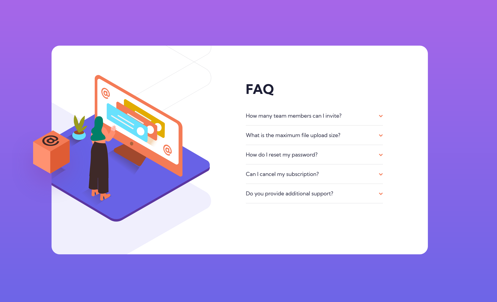
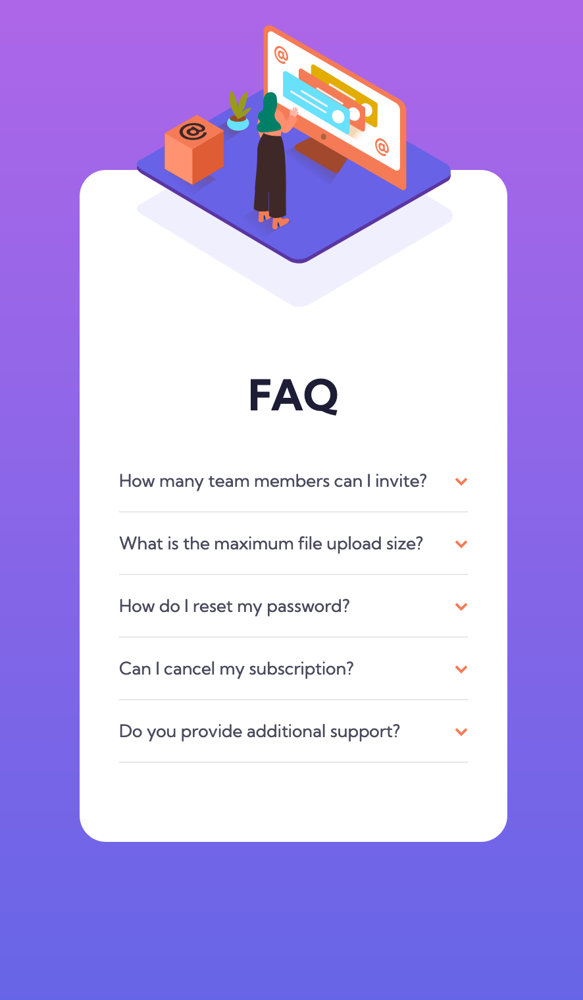

# Frontend Mentor - FAQ accordion card solution

This is a solution to the [FAQ accordion card challenge on Frontend Mentor](https://www.frontendmentor.io/challenges/faq-accordion-card-XlyjD0Oam). Frontend Mentor challenges help you improve your coding skills by building realistic projects. 

## Table of contents

- [Overview](#overview)
  - [The challenge](#the-challenge)
  - [Screenshots](#screenshots)
  - [Links](#links)
- [My process](#my-process)
  - [Built with](#built-with)
  - [What I learned](#what-i-learned)
  - [Useful resources](#useful-resources)
- [Author](#author)

**Note: Delete this note and update the table of contents based on what sections you keep.**

## Overview

### The challenge

Users should be able to:

- View the optimal layout for the component depending on their device's screen size
- See hover states for all interactive elements on the page
- Hide/Show the answer to a question when the question is clicked

### Screenshots

#### Desktop


#### Mobile


### Links

- Solution URL: [Github](https://github.com/jenn-chav13/faq-accordion-card-main)
- Live Site URL: [Github Page](https://jenn-chav13.github.io/faq-accordion-card-main/)

## My process

### Built with

- Semantic HTML5 markup
- CSS custom properties
- Flexbox
- Mobile-first workflow

### What I learned

This entire project was a learning experience.
I started working on the mobile version and the first challenge I encountered was placing the image at the top edge of the container.

For this, I learned that I can take an element out of "the box" with `position: absolute` and that I can make sure that this element is still relative to its container by adding `position: relative` to it. 

```css
/** parent container **/
.accordion-image {
    position: relative;
}

/** Element I want to position on the edge of the container **/
#illustration {
    position: absolute;
    top: -110px;
}
```

I also learned how to make collapsible sections by using checkbox items. Turns out you can also style items in relation to their siblings. So if I have the following:

```html
<div class="accordion-content-tab">
          <input type="checkbox" name="checkbox1" id="checkbox1">
          <label for="checkbox1">How many team members can I invite?</label>
          <p> You can invite up to 2 additional users on the Free plan. There is no limit on 
            team members for the Premium plan.
          </p>
        </div>
```
I can style the `<label>` and `<p>` elements based on their sibling `<input type="checkbox">`'s state by using the `~` symbol in CSS.

```css
input:checked ~ label {
    color: var(--Very-dark-grayish-blue);
    font-weight: 700;
}

input:checked ~ p {
    max-height: 100vh;
    padding-bottom: 15px;
    color: var(--Dark-grayish-blue);
    transition: all .35s;
}
```

I learned to use transitions so that the arrows can rotate when a section is expanded! The `transition` property will take care of it.

```css
input:checked ~ label::after {
    transform: rotate(-180deg);
    transition: all .35s;
}
```

I learned to collapse sections by setting their max-height to 0:

```css
.accordion-content-tab p {
    max-height: 0;
}
```
And then expanding these sections on click by setting up their max-height again! (The transition property will make it look nice when you click on it.)

```css
input:checked ~ p {
    max-height: 100vh;
    transition: all .35s;
}
```

Working on the desktop version, I learned that you can add more than one url per background in an element:

```css
background: url(./images/illustration-woman-online-desktop.svg) bottom 80px left -85px no-repeat, url(./images/bg-pattern-desktop.svg) bottom -140px left -575px no-repeat;
```

And I applied what I learned while working on the mobile version and placed the box thingy on the edge of the main container:

```css
.accordion::before {
        content: "";
        background: url(./images/illustration-box-desktop.svg) no-repeat;
        width: 191px;
        height: 184px;
        position: relative;
        top: 205px;
        left: -365px;
    }
```

### Useful resources

- [Understand ‘+’, ‘>’ and ‘~’ symbols in CSS Selector](https://techbrij.com/css-selector-adjacent-child-sibling)
- [CSS Position Relative vs Position Absolute](https://kolosek.com/css-position-relative-vs-position-absolute/)
- [How to Build an Accordion Component With the CSS Checkbox Hack](https://webdesign.tutsplus.com/tutorials/accordion-component-with-css-checkbox-hack--cms-34105)


## Author

- Frontend Mentor - [@jenn-chav13](hhttps://www.frontendmentor.io/profile/jenn-chav13)

